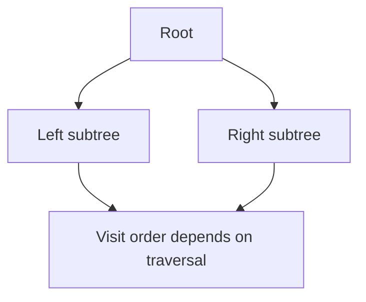

## 1. What
Trees organize data hierarchically. A binary tree restricts each node to at most two children, which makes recursion, traversal, and ordering rules especially tractable.

Important textbook branches include traversal strategies, threaded binary trees, binary search trees, and balanced trees such as AVL or Red-Black Trees.

## 2. Why
Trees matter because they model hierarchy and ordered search efficiently:

- file systems and DOM-like structures are hierarchical
- balanced search trees support ordered dictionaries
- traversals provide reusable visit patterns
- many indexes and parsers rely on tree-shaped structure

Binary trees are also the bridge between recursive definitions and iterative implementations.

## 3. How
Classical traversals:

```text
preorder(node):
  visit(node)
  preorder(node.left)
  preorder(node.right)

inorder(node):
  inorder(node.left)
  visit(node)
  inorder(node.right)

postorder(node):
  postorder(node.left)
  postorder(node.right)
  visit(node)
```

Level-order traversal uses a queue:

```text
enqueue(root)
while queue not empty:
  node = dequeue()
  visit(node)
  enqueue(node.left)
  enqueue(node.right)
```

Threaded binary trees replace null child pointers with predecessor or successor links so traversal can reuse otherwise empty pointers. Balanced trees maintain a height or color invariant so search, insert, and delete remain `O(log n)` in the worst case.



## 4. Better
Compared with linear structures, trees reduce search depth for ordered data. A balanced binary search tree provides ordered insertion, lookup, predecessor/successor queries, and range traversal in one structure.

Compared with hash tables, balanced trees are usually slower for exact lookup but better for ordered iteration and range queries. Compared with general graphs, trees are simpler because they have no cycles and exactly one simple path between root-connected nodes.

Threaded trees are conceptually elegant for traversal, but less common in production than stack-based or parent-pointer traversal because they complicate updates.

## 5. Beyond
Unbalanced search trees degrade to linked-list behavior in the worst case. That is why balanced variants or randomized trees matter.

In practice, B-Trees and B+Trees dominate storage systems more than classic binary trees because they reduce disk or page accesses. The deeper lesson is that tree shape should match the memory model: binary trees are pedagogically clean, but broader fan-out wins on modern storage hierarchies.
