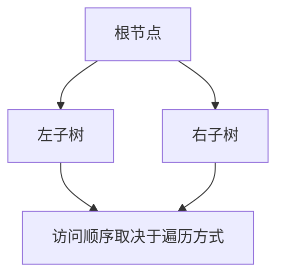

## 1. What
树用层次结构来组织数据。二叉树进一步限制每个节点最多只有两个孩子，因此在递归定义、遍历方式和有序规则上都特别典型。

教材里的核心分支通常包括遍历、线索二叉树、二叉搜索树，以及 AVL、红黑树这类平衡树。

## 2. Why
树结构重要，是因为它能高效表达层次关系和有序搜索：

- 文件系统、DOM 一类结构天然是层次化的
- 平衡搜索树适合做有序字典
- 各种遍历方式提供了通用访问模式
- 很多索引与语法结构都依赖树形组织

二叉树也是把递归定义转化为可执行算法的经典入口。

## 3. How
经典遍历如下：

```text
preorder(node):
  visit(node)
  preorder(node.left)
  preorder(node.right)

inorder(node):
  inorder(node.left)
  visit(node)
  inorder(node.right)

postorder(node):
  postorder(node.left)
  postorder(node.right)
  visit(node)
```

层序遍历则依赖队列：

```text
enqueue(root)
while queue not empty:
  node = dequeue()
  visit(node)
  enqueue(node.left)
  enqueue(node.right)
```

线索二叉树会把空指针改造成前驱或后继线索，从而复用原本为空的链接。平衡树则通过高度、颜色等不变量，保证查找、插入、删除在最坏情况下仍保持 `O(log n)`。



## 4. Better
和线性结构相比，树能显著降低有序数据的查找深度。平衡二叉搜索树把查找、插入、前驱后继查询和区间遍历统一到一个结构里。

和哈希表相比，平衡树做精确查找通常略慢，但在有序遍历和范围查询上更有优势。和一般图相比，树更简单，因为它没有环，并且在同一棵连通树中节点之间路径唯一。

线索树在遍历思想上很优雅，但在工程里不如显式栈或父指针方案常见，因为更新结构时维护线索会更复杂。

## 5. Beyond
如果不做平衡控制，二叉搜索树在最坏情况下会退化成链表，因此平衡化或随机化非常关键。

在真实存储系统里，B-Tree 和 B+Tree 往往比经典二叉树更重要，因为它们能显著减少磁盘页或缓存页访问。更深层的结论是：树的形态必须匹配内存层级，二叉树便于教学，但大分支因子更适合现代存储环境。
